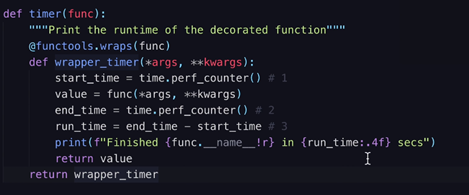
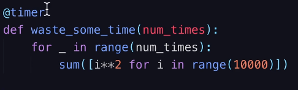

# **Python from a Java Developers**
## **Useful Links**
[**Python for Java developers**](https://lobster1234.github.io/2017/05/25/python-java-primer/)

**Global Variables**

- https://www.w3schools.com/python/python\_variables\_global.asp

[Learn Python](http://learnpython.org/)

[Python regular expression test](https://pythex.org/)

[Python Ternary Condition Expression](https://www.pythoncentral.io/one-line-if-statement-in-python-ternary-conditional-operator/)

<https://www.regextester.com/>

<https://pypi.org/>

<https://hackr.io/blog/best-python-books-for-beginners-and-advanced-programmers>

<http://greenteapress.com/thinkpython/thinkCSpy/thinkCSpy.pdf>

[Python and Dictionaries](http://learnpython.org/en/Dictionaries)

<https://docs.aws.amazon.com/glue/latest/dg/dev-endpoint-tutorial-pycharm.html>

[Boto3 & Python](https://realpython.com/python-boto3-aws-s3/) \*\* → [Boto3](https://boto3.amazonaws.com/v1/documentation/api/latest/index.html) is the name of the Python SDK for AWS. It allows you to directly create, update, and delete AWS resources from your Python scripts.

<https://boto3.amazonaws.com/v1/documentation/api/latest/guide/quickstart.html>

<https://docs.aws.amazon.com/general/latest/gr/aws-sec-cred-types.html> - Access id/key

**Show installed package →** pip show boto3

<https://app.pluralsight.com/library/courses/python-getting-started/table-of-contents> → basic python

**Virtual Environment :**

[There is something in the Python world](https://app.pluralsight.com/player?course=python-getting-started&author=bo-milanovich&name=python-getting-started-m6&clip=1&mode=live&start=2.388) [called a virtual environment. What is it](https://app.pluralsight.com/player?course=python-getting-started&author=bo-milanovich&name=python-getting-started-m6&clip=1&mode=live&start=5.569818181818181) [exactly? Well, virtual environments allow](https://app.pluralsight.com/player?course=python-getting-started&author=bo-milanovich&name=python-getting-started-m6&clip=1&mode=live&start=8.513) [you to set up independent Python](https://app.pluralsight.com/player?course=python-getting-started&author=bo-milanovich&name=python-getting-started-m6&clip=1&mode=live&start=10.388) [environments when you're working on your](https://app.pluralsight.com/player?course=python-getting-started&author=bo-milanovich&name=python-getting-started-m6&clip=1&mode=live&start=12.638) [Python application. Imagine you're working](https://app.pluralsight.com/player?course=python-getting-started&author=bo-milanovich&name=python-getting-started-m6&clip=1&mode=live&start=15.234153846153847) [on a web app. The web app you're working](https://app.pluralsight.com/player?course=python-getting-started&author=bo-milanovich&name=python-getting-started-m6&clip=1&mode=live&start=17.54184615384615) [on for your client uses Django 1. 8 even](https://app.pluralsight.com/player?course=python-getting-started&author=bo-milanovich&name=python-getting-started-m6&clip=1&mode=live&start=21.387999999999995) [though that's not the latest version, but](https://app.pluralsight.com/player?course=python-getting-started&author=bo-milanovich&name=python-getting-started-m6&clip=1&mode=live&start=24.987999999999982) [it is the latest long-term support](https://app.pluralsight.com/player?course=python-getting-started&author=bo-milanovich&name=python-getting-started-m6&clip=1&mode=live&start=27.651157894736844) [release. However, you also want to have](https://app.pluralsight.com/player?course=python-getting-started&author=bo-milanovich&name=python-getting-started-m6&clip=1&mode=live&start=29.2301052631579) [Django 1. 11 installed on your machine](https://app.pluralsight.com/player?course=python-getting-started&author=bo-milanovich&name=python-getting-started-m6&clip=1&mode=live&start=31.072210526315796) [because you want to get your hands dirty,](https://app.pluralsight.com/player?course=python-getting-started&author=bo-milanovich&name=python-getting-started-m6&clip=1&mode=live&start=33.21152941176471) [maybe check out that new admin interface.](https://app.pluralsight.com/player?course=python-getting-started&author=bo-milanovich&name=python-getting-started-m6&clip=1&mode=live&start=36.50564705882355) [Either way, you cannot have both versions](https://app.pluralsight.com/player?course=python-getting-started&author=bo-milanovich&name=python-getting-started-m6&clip=1&mode=live&start=39.388) [of Django installed on your machine.](https://app.pluralsight.com/player?course=python-getting-started&author=bo-milanovich&name=python-getting-started-m6&clip=1&mode=live&start=41.541846153846144) [There's going to be a version conflict, so](https://app.pluralsight.com/player?course=python-getting-started&author=bo-milanovich&name=python-getting-started-m6&clip=1&mode=live&start=43.388) [you can only have one of those two](https://app.pluralsight.com/player?course=python-getting-started&author=bo-milanovich&name=python-getting-started-m6&clip=1&mode=live&start=45.740941176470606)[installed. But what you can do is simply](https://app.pluralsight.com/player?course=python-getting-started&author=bo-milanovich&name=python-getting-started-m6&clip=1&mode=live&start=48.093882352941215) [create two isolated Python environments.](https://app.pluralsight.com/player?course=python-getting-started&author=bo-milanovich&name=python-getting-started-m6&clip=1&mode=live&start=51.888) [In each one of these isolated environments](https://app.pluralsight.com/player?course=python-getting-started&author=bo-milanovich&name=python-getting-started-m6&clip=1&mode=live&start=54.388) [you can install whatever packages you want](https://app.pluralsight.com/player?course=python-getting-started&author=bo-milanovich&name=python-getting-started-m6&clip=1&mode=live&start=56.138) [completely independent of each other, and](https://app.pluralsight.com/player?course=python-getting-started&author=bo-milanovich&name=python-getting-started-m6&clip=1&mode=live&start=57.888) [they both live on the same machine. Heck,](https://app.pluralsight.com/player?course=python-getting-started&author=bo-milanovich&name=python-getting-started-m6&clip=1&mode=live&start=60.07221052631578) [you can even use the different Python](https://app.pluralsight.com/player?course=python-getting-started&author=bo-milanovich&name=python-getting-started-m6&clip=1&mode=live&start=63.44063157894734) [interpreter versions as well. On my](https://app.pluralsight.com/player?course=python-getting-started&author=bo-milanovich&name=python-getting-started-m6&clip=1&mode=live&start=66.388) [personal machine, I have a virtual](https://app.pluralsight.com/player?course=python-getting-started&author=bo-milanovich&name=python-getting-started-m6&clip=1&mode=live&start=68.05466666666663)[environment with Python 3. 6 for this](https://app.pluralsight.com/player?course=python-getting-started&author=bo-milanovich&name=python-getting-started-m6&clip=1&mode=live&start=69.72133333333326) [course, then Python 3. 5. 1 for my](https://app.pluralsight.com/player?course=python-getting-started&author=bo-milanovich&name=python-getting-started-m6&clip=1&mode=live&start=71.86168421052632) [personal web project because that's the](https://app.pluralsight.com/player?course=python-getting-started&author=bo-milanovich&name=python-getting-started-m6&clip=1&mode=live&start=75.65115789473684) [Python version that my web server provider](https://app.pluralsight.com/player?course=python-getting-started&author=bo-milanovich&name=python-getting-started-m6&clip=1&mode=live&start=78.49326315789473) [has. Then I have one for version 2. 7 and](https://app.pluralsight.com/player?course=python-getting-started&author=bo-milanovich&name=python-getting-started-m6&clip=1&mode=live&start=81.38799999999999) [so on. It is fairly common to have many](https://app.pluralsight.com/player?course=python-getting-started&author=bo-milanovich&name=python-getting-started-m6&clip=1&mode=live&start=84.72133333333328) [virtual environments set up on your](https://app.pluralsight.com/player?course=python-getting-started&author=bo-milanovich&name=python-getting-started-m6&clip=1&mode=live&start=87.7213333333333) [machine, especially if you're working on](https://app.pluralsight.com/player?course=python-getting-started&author=bo-milanovich&name=python-getting-started-m6&clip=1&mode=live&start=89.72133333333328) [multiple applications. They each have](https://app.pluralsight.com/player?course=python-getting-started&author=bo-milanovich&name=python-getting-started-m6&clip=1&mode=live&start=91.77688888888889) [their own packages, and they don't care](https://app.pluralsight.com/player?course=python-getting-started&author=bo-milanovich&name=python-getting-started-m6&clip=1&mode=live&start=93.72133333333332) [about each other at all. Now this may all](https://app.pluralsight.com/player?course=python-getting-started&author=bo-milanovich&name=python-getting-started-m6&clip=1&mode=live&start=96.44355555555552) [sound silly and unnecessary to you at this](https://app.pluralsight.com/player?course=python-getting-started&author=bo-milanovich&name=python-getting-started-m6&clip=1&mode=live&start=99.72133333333332) [point, but when you start working on an](https://app.pluralsight.com/player?course=python-getting-started&author=bo-milanovich&name=python-getting-started-m6&clip=1&mode=live&start=102.38799999999995) [even slightly more complicated Python](https://app.pluralsight.com/player?course=python-getting-started&author=bo-milanovich&name=python-getting-started-m6&clip=1&mode=live&start=105.05466666666658) [application, you will really appreciate](https://app.pluralsight.com/player?course=python-getting-started&author=bo-milanovich&name=python-getting-started-m6&clip=1&mode=live&start=106.388) [the power and ease of use of virtual](https://app.pluralsight.com/player?course=python-getting-started&author=bo-milanovich&name=python-getting-started-m6&clip=1&mode=live&start=107.638) [environments. To start using a virtual](https://app.pluralsight.com/player?course=python-getting-started&author=bo-milanovich&name=python-getting-started-m6&clip=1&mode=live&start=110.888) [environment, you first need to install the](https://app.pluralsight.com/player?course=python-getting-started&author=bo-milanovich&name=python-getting-started-m6&clip=1&mode=live&start=114.263)[virtualenv package using pip. So just run](https://app.pluralsight.com/player?course=python-getting-started&author=bo-milanovich&name=python-getting-started-m6&clip=1&mode=live&start=116.888) [pip and install virtualenv. From then on,](https://app.pluralsight.com/player?course=python-getting-started&author=bo-milanovich&name=python-getting-started-m6&clip=1&mode=live&start=119.44682352941179) [the virtualenv command will be globally](https://app.pluralsight.com/player?course=python-getting-started&author=bo-milanovich&name=python-getting-started-m6&clip=1&mode=live&start=121.91741176470595) [available in your terminal or PowerShell.](https://app.pluralsight.com/player?course=python-getting-started&author=bo-milanovich&name=python-getting-started-m6&clip=1&mode=live&start=124.03505882352951) [Creating a virtual environment is super](https://app.pluralsight.com/player?course=python-getting-started&author=bo-milanovich&name=python-getting-started-m6&clip=1&mode=live&start=128.388) [simple. Just type virtualenv and then](https://app.pluralsight.com/player?course=python-getting-started&author=bo-milanovich&name=python-getting-started-m6&clip=1&mode=live&start=130.50564705882348) [followed by the environment name. The](https://app.pluralsight.com/player?course=python-getting-started&author=bo-milanovich&name=python-getting-started-m6&clip=1&mode=live&start=132.62329411764696) [environment name can be whatever you want.](https://app.pluralsight.com/player?course=python-getting-started&author=bo-milanovich&name=python-getting-started-m6&clip=1&mode=live&start=134.83244444444446) [For example, I created a virtualenv for](https://app.pluralsight.com/player?course=python-getting-started&author=bo-milanovich&name=python-getting-started-m6&clip=1&mode=live&start=137.94355555555566) [this course called Pluralsight Getting](https://app.pluralsight.com/player?course=python-getting-started&author=bo-milanovich&name=python-getting-started-m6&clip=1&mode=live&start=141.05466666666686) [Started. Now that's a mouthful. I usually](https://app.pluralsight.com/player?course=python-getting-started&author=bo-milanovich&name=python-getting-started-m6&clip=1&mode=live&start=143.18800000000002) [name my virtual environments according to](https://app.pluralsight.com/player?course=python-getting-started&author=bo-milanovich&name=python-getting-started-m6&clip=1&mode=live&start=145.98800000000006) [the project name. You can specify the](https://app.pluralsight.com/player?course=python-getting-started&author=bo-milanovich&name=python-getting-started-m6&clip=1&mode=live&start=148.388) [Python version that you want your](https://app.pluralsight.com/player?course=python-getting-started&author=bo-milanovich&name=python-getting-started-m6&clip=1&mode=live&start=150.23010526315795) [virtualenv to use by passing the --python](https://app.pluralsight.com/player?course=python-getting-started&author=bo-milanovich&name=python-getting-started-m6&clip=1&mode=live&start=151.80905263157905) [flag and putting the path to your Python](https://app.pluralsight.com/player?course=python-getting-started&author=bo-milanovich&name=python-getting-started-m6&clip=1&mode=live&start=153.94355555555555) [executable. Also, here's a tip: It's](https://app.pluralsight.com/player?course=python-getting-started&author=bo-milanovich&name=python-getting-started-m6&clip=1&mode=live&start=158.3879999999999) [totally okay to keep all of your creative](https://app.pluralsight.com/player?course=python-getting-started&author=bo-milanovich&name=python-getting-started-m6&clip=1&mode=live&start=161.72133333333315) [virtual environments in one folder. For](https://app.pluralsight.com/player?course=python-getting-started&author=bo-milanovich&name=python-getting-started-m6&clip=1&mode=live&start=164.9669473684211) [example, I have a folder in my home](https://app.pluralsight.com/player?course=python-getting-started&author=bo-milanovich&name=python-getting-started-m6&clip=1&mode=live&start=166.86168421052642) [directory called venvs. This is where all](https://app.pluralsight.com/player?course=python-getting-started&author=bo-milanovich&name=python-getting-started-m6&clip=1&mode=live&start=169.388) [my of virtual environments live. This is](https://app.pluralsight.com/player?course=python-getting-started&author=bo-milanovich&name=python-getting-started-m6&clip=1&mode=live&start=171.7213333333334) [perfectly fine. Finally, when you're done](https://app.pluralsight.com/player?course=python-getting-started&author=bo-milanovich&name=python-getting-started-m6&clip=1&mode=live&start=175.388) [creating an environment, you need to](https://app.pluralsight.com/player?course=python-getting-started&author=bo-milanovich&name=python-getting-started-m6&clip=1&mode=live&start=178.72133333333338) [activate it. When the environment was](https://app.pluralsight.com/player?course=python-getting-started&author=bo-milanovich&name=python-getting-started-m6&clip=1&mode=live&start=180.72133333333343) [created, it created a folder with the same](https://app.pluralsight.com/player?course=python-getting-started&author=bo-milanovich&name=python-getting-started-m6&clip=1&mode=live&start=182.72133333333338) [name as the virtual environment name and](https://app.pluralsight.com/player?course=python-getting-started&author=bo-milanovich&name=python-getting-started-m6&clip=1&mode=live&start=185.38800000000012) [several subfolders. In order to activate](https://app.pluralsight.com/player?course=python-getting-started&author=bo-milanovich&name=python-getting-started-m6&clip=1&mode=live&start=187.74094117647059) [the virtual environment, simply type](https://app.pluralsight.com/player?course=python-getting-started&author=bo-milanovich&name=python-getting-started-m6&clip=1&mode=live&start=189.85858823529406) [source, then the path to your virtual](https://app.pluralsight.com/player?course=python-getting-started&author=bo-milanovich&name=python-getting-started-m6&clip=1&mode=live&start=191.62329411764696) [environment folder, followed by the](https://app.pluralsight.com/player?course=python-getting-started&author=bo-milanovich&name=python-getting-started-m6&clip=1&mode=live&start=194.388) [/bin/activate. If successful, your](https://app.pluralsight.com/player?course=python-getting-started&author=bo-milanovich&name=python-getting-started-m6&clip=1&mode=live&start=196.888) [terminal or PowerShell prompt should be](https://app.pluralsight.com/player?course=python-getting-started&author=bo-milanovich&name=python-getting-started-m6&clip=1&mode=live&start=198.888) [prefixed with the virtual environment](https://app.pluralsight.com/player?course=python-getting-started&author=bo-milanovich&name=python-getting-started-m6&clip=1&mode=live&start=202.0755) [name. Now when your virtual environment is](https://app.pluralsight.com/player?course=python-getting-started&author=bo-milanovich&name=python-getting-started-m6&clip=1&mode=live&start=204.888) [activated, if you install packages using](https://app.pluralsight.com/player?course=python-getting-started&author=bo-milanovich&name=python-getting-started-m6&clip=1&mode=live&start=208.8255) [pip, it will only be installed to that](https://app.pluralsight.com/player?course=python-getting-started&author=bo-milanovich&name=python-getting-started-m6&clip=1&mode=live&start=211.263) [specific virtual environment. It will not](https://app.pluralsight.com/player?course=python-getting-started&author=bo-milanovich&name=python-getting-started-m6&clip=1&mode=live&start=214.263) [be available outside of it even in the](https://app.pluralsight.com/player?course=python-getting-started&author=bo-milanovich&name=python-getting-started-m6&clip=1&mode=live&start=216.4594285714286) [global Python environment. Similarly, when](https://app.pluralsight.com/player?course=python-getting-started&author=bo-milanovich&name=python-getting-started-m6&clip=1&mode=live&start=219.31657142857148) [you use the Python command directly, it](https://app.pluralsight.com/player?course=python-getting-started&author=bo-milanovich&name=python-getting-started-m6&clip=1&mode=live&start=220.97623529411763) [will use the Python interpreter that you](https://app.pluralsight.com/player?course=python-getting-started&author=bo-milanovich&name=python-getting-started-m6&clip=1&mode=live&start=223.0350588235293) [created for that virtual environment. To](https://app.pluralsight.com/player?course=python-getting-started&author=bo-milanovich&name=python-getting-started-m6&clip=1&mode=live&start=225.093882352941) [leave the virtual environment, simply type](https://app.pluralsight.com/player?course=python-getting-started&author=bo-milanovich&name=python-getting-started-m6&clip=1&mode=live&start=229.81657142857142) [deactivate while your virtual environment](https://app.pluralsight.com/player?course=python-getting-started&author=bo-milanovich&name=python-getting-started-m6&clip=1&mode=live&start=232.38799999999992) [is active. PyCharm is also able to work](https://app.pluralsight.com/player?course=python-getting-started&author=bo-milanovich&name=python-getting-started-m6&clip=1&mode=live&start=234.530857142857) [with virtual environments and can help you](https://app.pluralsight.com/player?course=python-getting-started&author=bo-milanovich&name=python-getting-started-m6&clip=1&mode=live&start=237.05466666666663) [set them up as well. Simply search for the](https://app.pluralsight.com/player?course=python-getting-started&author=bo-milanovich&name=python-getting-started-m6&clip=1&mode=live&start=238.99911111111103) [interpreter options in the PyCharm](https://app.pluralsight.com/player?course=python-getting-started&author=bo-milanovich&name=python-getting-started-m6&clip=1&mode=live&start=242.388) [settings. Speaking of PyCharm, let's](https://app.pluralsight.com/player?course=python-getting-started&author=bo-milanovich&name=python-getting-started-m6&clip=1&mode=live&start=244.888) [explore another great feature that it](https://app.pluralsight.com/player?course=python-getting-started&author=bo-milanovich&name=python-getting-started-m6&clip=1&mode=live&start=249.388) [comes with, and that's debugging our Python code.](https://app.pluralsight.com/player?course=python-getting-started&author=bo-milanovich&name=python-getting-started-m6&clip=1&mode=live&start=255.388)

[**https://www.pyinstaller.org/](https://www.pyinstaller.org/)**, pyinstaller** - [is](https://app.pluralsight.com/player?course=python-getting-started&author=bo-milanovich&name=python-getting-started-m6&clip=3&mode=live&start=31.058) [a Python package that allows us to create](https://app.pluralsight.com/player?course=python-getting-started&author=bo-milanovich&name=python-getting-started-m6&clip=3&mode=live&start=33.433) [binary executable files from our Python](https://app.pluralsight.com/player?course=python-getting-started&author=bo-milanovich&name=python-getting-started-m6&clip=3&mode=live&start=37.433) [program. It is cross-platform so it will](https://app.pluralsight.com/player?course=python-getting-started&author=bo-milanovich&name=python-getting-started-m6&clip=3&mode=live&start=40.09966666666667) [create the. exe file for Windows and a.](https://app.pluralsight.com/player?course=python-getting-started&author=bo-milanovich&name=python-getting-started-m6&clip=3&mode=live&start=42.43300000000002) [app file for Mac. It also works under](https://app.pluralsight.com/player?course=python-getting-started&author=bo-milanovich&name=python-getting-started-m6&clip=3&mode=live&start=45.09966666666671) [Linux 2 and a gazillion other platforms.](https://app.pluralsight.com/player?course=python-getting-started&author=bo-milanovich&name=python-getting-started-m6&clip=3&mode=live&start=48.25118181818181)

pyinstaller --onefile ./yourpythonfile.py → this creates one single file as exe as opposed to an small exe files and other dependent files.

**Setup Wizard**

**Inno Setup → jrsoftware.org**

[@staticmethod](https://stackabuse.com/pythons-classmethod-and-staticmethod-explained/)

[i](https://pymotw.com/3/importlib/)[mportlib - import modules dynamically](https://pymotw.com/3/importlib/)
### **Dump - print all the attributes of an object/class**
def dump(obj):

`  `for attr in dir(obj):

`    `print("obj.%s = %r" % (attr, getattr(obj, attr)))
### **Yield - use case process large file without reading the entire file at once**
yield is best used when you have a function that returns a sequence and you want to iterate over that sequence, but you do not need to have every value in memory at once.

For example, I have a python script that parses a large list of CSV files, and I want to return each line to be processed in another function. I don't want to store the megabytes of data in memory all at once, so I yield each line in a python data structure. So the function to get lines from the file might look something like:

def get\_lines(files):

`    `for f in files:

`        `for line in f:

`            `#preprocess line

`            `yield line

I can then use the same syntax as with lists to access the output of this function:

for line in get\_lines(files):

`    `#process line

but I save a lot of memory usage.

**ref:** <https://stackoverflow.com/questions/7883962/where-to-use-yield-in-python-best>
## **Print stack trace**
import traceback 

\# declaring and assigning array 
A = [1, 2, 3, 4]   
\# exception handling 
try: 
`    `value = A[5]       
except: 
`    `# printing stack trace 
`    `traceback.print\_exc()

\# out of try-except 
\# this statement is to show 
\# that program continues normally 
\# after an exception is handled 
print("end of program")

#----------------------------------------------------
## **Decorators in python - allows behavior to be added to an individual [object](https://en.wikipedia.org/wiki/Object_\(computer_science\) "Object (computer science)"), dynamically,**
## **ref: [https://realpython.com/lessons/timing-functions-decorators/**](https://realpython.com/lessons/timing-functions-decorators/)**

### **Elapsed time**
import time

start\_time = time.perf\_counter()

end\_time = time.perf\_counter()

runt\_time= end\_time - start\_time

print(f"Time elapsed  {end\_time:.4f} secs")
## **Yield and for loop**
pass keyword - kind of no-op operation
## **Exception**
Traceback module, TypeError as error

TypeError, KeyError, ValueError, catch all error → Exception

DataTypes

Tuple - immutable list. Example tuple = (3,5,6, "abc")

\*args

\*\*kwargs

def call():

`        `raise ValueError('record count failed to match')

`        `return

try:

`        `call()  

except ValueError as identifier:

`    `print(identifier) # prints the error message 'record count failed to match'

#The repr() function returns a printable representation of the given object.

msg = {'x':1,'y':2}

print(repr(msg))

output on console: "{'x': 1, 'y': 2}"

\# in the folloiwng case, The type(object) function returns the type of the object.

\# It could return a new type object based on the arguments passed

print(type(msg))

output on console: <class 'dict'>

#python dictionaries are key value pairs like  Hashmap in java, but can support mixed data types unlike java

\# dict. to json and back

student = {

`        `"name": "MArk",

`        `"rollnumber":123,

`        `"school": "python school"

`        `"misc": None,

`     `"msgdict": msg

}

student["name"] == "MArk"

student.get("last\_name") == KeyError

student.get("last\_name", "Unknown") == "Unknown"

student.keys()

student.values()

### **Classes** 
Inheritance and Compostion → <https://realpython.com/lessons/inheritance-composition-python-overview/>

<https://openbookproject.net/thinkcs/python/english3e/classes_and_objects_I.html>

#studentpy

students = []

class Student:

`        `school\_name = "Springfield Elementary"

`        `def \_\_init\_\_(self, name, student\_id=332):

`               `self.name = name

`               `self.student\_id = student\_id

`               `students.append(self)

`        `def \_\_str\_\_(self):

`               `return "Student " + self.name

`        `def get\_name\_capitalize(self):

`               `return self.name.capitalize()

`        `def get\_school\_name(self):

`               `return self.school\_name

mark = Student("Mark")

print(mark);

\---------------

#highschoolstudent.py

from student import Student

\# Student base class and HighSchoolStudent childor derived class

class HighSchoolStudent(Student):

`        `school\_name = "Springfield High School"

`        `def get\_school\_name(self):

`               `return "This is a High School student"

`        `def get\_name\_capitalize(self):

`               `original\_value = super().get\_name\_capitalize()

`               `return original\_value + "-HS"

#main.py

from hs\_student import \*

james = HighSchoolStudent("james")

print(james.get\_name\_capitalize())

output to console: James-HS

## **Unit test python**
<https://medium.com/@bezdelev/how-to-test-a-python-aws-lambda-function-locally-with-pycharm-run-configurations-6de8efc4b206> - won't work for us

pip install --trusted-host [pypi.org](http://pypi.org) python-lambda-local

[**Python Elasticbeanstalk support multiple request with PyFlask**](https://forums.aws.amazon.com/thread.jspa?threadID=232777)

[**Python and multithreading**](https://www.toptal.com/python/beginners-guide-to-concurrency-and-parallelism-in-python)

